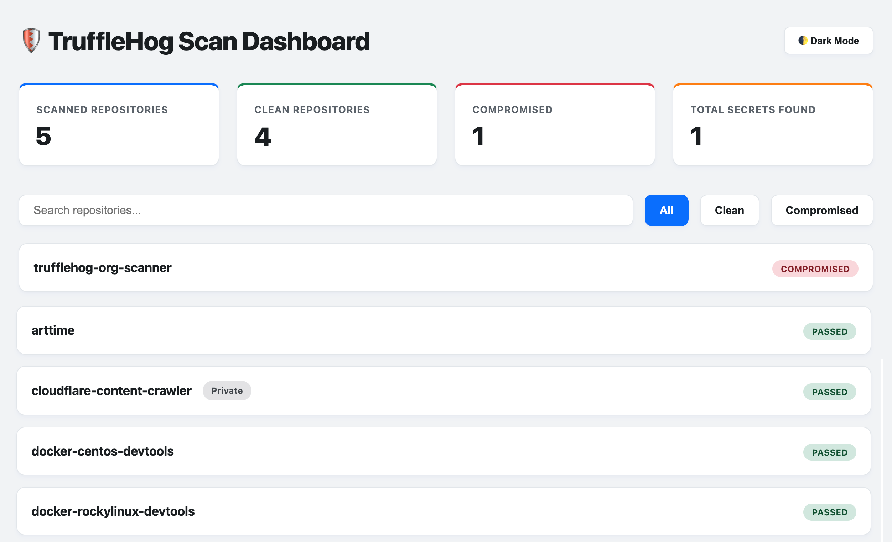

# 🛡️ TruffleHog GitHub Organization Scanner

A high-performance, parallelized Python-based scanner that automates secret and credential detection across all accessible repositories in any GitHub Organization.



---

## ✨ Features

- **Automated Repository Discovery:** Integrates directly with the GitHub CLI (`gh`) to automatically fetch all accessible public and private organizational repositories.
- **Deep Git History Scan:** Leverages TruffleHog (Community Edition) to scan the entire git commit history of discovered repositories.
- **Visual Parallel Execution:** Built on top of **pytest** and **pytest-xdist** to run scans concurrently in parallel workers. Features real-time terminal progress indicators.
- **Interactive Light-Mode HTML Dashboard:** Compiles a standalone responsive summary page (`scans/summary.html`) featuring:
  - Metric summary cards (Scanned, Clean, Compromised, Total Secrets).
  - Search box filtering by repository name.
  - Quick filter tabs (All, Clean, Compromised).
  - **Drill-down Accordions:** Click on any repository row to see detailed metadata (Detector, File Path, Line Number, Commit Hash, Redacted Key).
  - **Accessibility (a11y) Compliance:** Built with full keyboard navigation (Enter/Space keys), clear focus states, and standard ARIA attributes (`role="button"`, `aria-expanded`, `tabindex="0"`).
  - **Dark Mode Toggle:** Smooth transitions between slate-tinted Light and Dark themes.
- **Security-First Architecture:** 
  - Raw secrets are **never** logged to the CLI, console, or written to reports. Only non-sensitive metadata and masked credentials (redacted) are preserved.
  - Active GitHub tokens exist only in-memory and are never written to disk or configuration dumps.
  - Strict protection against shell injection via list-based subprocess executions.

---

## 📁 Output Directory Structure

The scanner cleanly isolates individual repository results from the high-level compiled summary dashboard:

```text
scans/                      # Main output directory (configurable)
├── repos/                  # Raw individual repository scan outputs
│   ├── org_repo-1.json     # Redacted metadata findings for repo 1
│   └── org_repo-2.json     # Redacted metadata findings for repo 2
├── summary.json            # Consolidated organizational JSON findings
└── summary.html            # Standalone interactive HTML Summary Dashboard
```

---

## 🛠️ Prerequisites

Before running the tool, ensure you have the following CLI utilities installed and available on your system `PATH`:

1. **Python 3.10+**
2. **GitHub CLI (`gh`)** - [Download & Install](https://cli.github.com/)
3. **TruffleHog (v3+)** - [Download & Install](https://github.com/trufflesecurity/trufflehog)

---

## ⚙️ Installation & Setup

1. Clone or copy this repository to your local workspace:
   ```bash
   git clone <repo-url> trufflehog-org-scanner
   cd trufflehog-org-scanner
   ```

2. Install the required Python dependencies:
   ```bash
   pip install -r requirements.txt
   ```

3. Authenticate with your GitHub account using the GitHub CLI:
   ```bash
   gh auth login
   ```
   *Note: Ensure your authenticated session has standard read permissions for the target organization's repositories.*

---

## 🚀 How to Run the Scanner

Use the `scan.py` orchestrator script to execute a scan.

### Basic Organization Scan
To scan all repositories in an organization (e.g., `my-organization`):
```bash
python3 scan.py --org my-organization
```

### Scan a Single Specific Repository
To scan only a single repository within your organization (e.g. `my-awesome-app`):
```bash
python3 scan.py --org my-organization --repo my-awesome-app
```
*Note: This will only execute TruffleHog against the specified repository, saving or updating its output inside `scans/repos/my-awesome-app.json`. The summary files (`summary.json`, `summary.html`) will be regenerated to merge this updated repository state with all other pre-existing repository scans.*

### Custom Output Directory
To save findings and reports into a different output folder (e.g., `reports/2026-06-05/`):
```bash
python3 scan.py --org my-organization --output-dir reports/2026-06-05
```

### Excluding Specific Repositories
To exclude specific repositories from being scanned, pass a comma-separated list:
```bash
python3 scan.py --org my-organization --exclude "my-test-repo, archived-repo"
```

### Controlling Parallelism (Threads)
By default, the scanner utilizes all available logical CPU cores (`-n auto`). You can limit this by specifying the thread count:
```bash
# Run with exactly 4 concurrent workers
python3 scan.py --org my-organization --threads 4

# Run sequentially (single worker)
python3 scan.py --org my-organization --threads 1
```

---

## 🧪 Running Tests

To run the complete unit and integration test suite (covering discovery logic, HTML report parsing, secure redaction, and CLI options):

```bash
pytest -v
```
